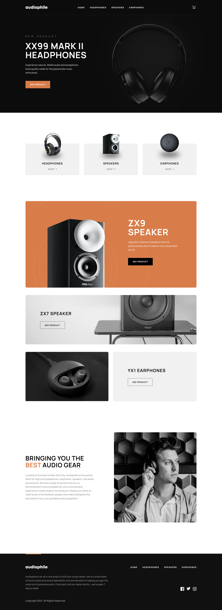
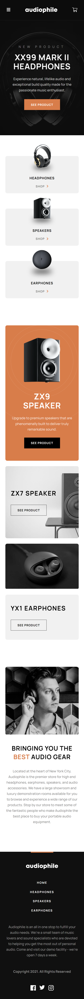
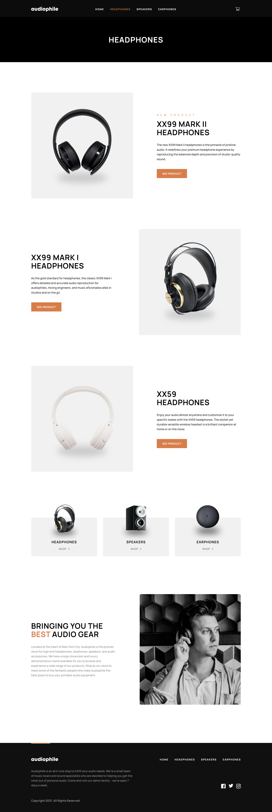
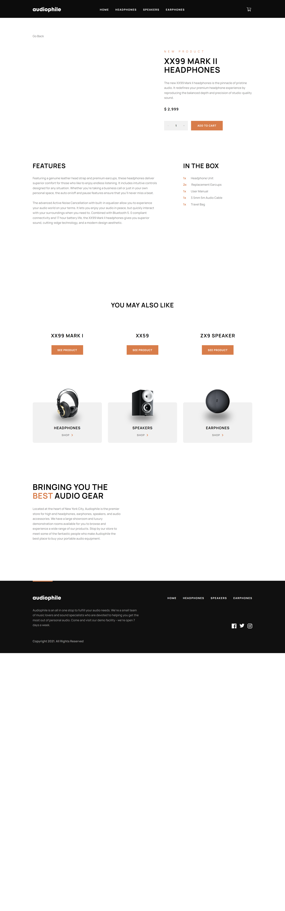
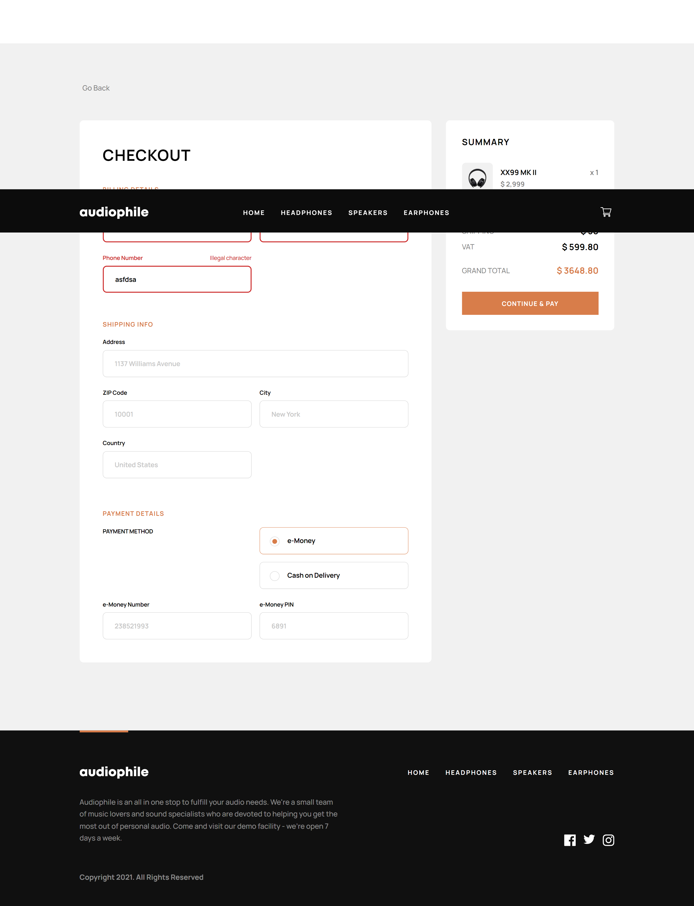
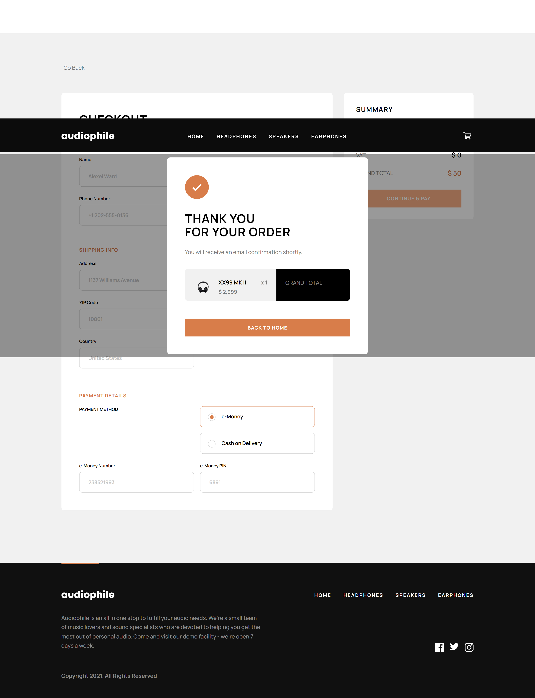

# Audiophile e-commerce website

## Contents

- [Overview](#overview)
  - [The challenge](#the-challenge)
  - [Screenshot](#screenshot)
  - [Links](#links)
- [My process](#my-process)
  - [Built with](#built-with)
  - [What I learned](#what-i-learned)
	- [Instructions for running the project locally](#instructions-for-running-the-project-locally)
  - [Continued development](#continued-development)

## Overview

Audiophile is a mock e-commerce website built as per the design and requirements provided by [Frontend Mentor](https://www.frontendmentor.io/). It features product listing, cart functionalities, and a checkout process with form validation. It has been developed with a focus on responsive design and is deployed on Netlify.

In its current state, the website is working, but there are still a few improvements that need to be made. 

If you view this website, please use a valid email when completing the checkout process. You will recieve an automated email from my address on checkout completion.

### The challenge

Below are the requirements for the website from Frontend Mentor.

Users should be able to:

- View the optimal layout for the app depending on their device's screen size
- See hover states for all interactive elements on the page
- Add/Remove products from the cart
- Edit product quantities in the cart
- Fill in all fields in the checkout
- Receive form validations if fields are missed or incorrect during checkout
- See correct checkout totals depending on the products in the cart
  - Shipping always adds $50 to the order
  - VAT is calculated as 20% of the product total, excluding shipping
- See an order confirmation modal after checking out with an order summary
- **Bonus**: Keep track of what's in the cart, even after refreshing the browser (`localStorage` could be used for this if you're not building out a full-stack app)

### Screenshots

#### Home Page Desktop View

#### Home Page Tablet View

#### Home Page Mobile View

#### Category Page Desktop View

#### Product Page Desktop View

#### Checkout Page Desktop View

#### Order Confirmation Desktop View

### Links

- Solution URL: [https://www.frontendmentor.io/solutions/audiophile-react-firebase-jest-reacttestinglibrary-reduxtool-zy2omLVrLs](https://www.frontendmentor.io/solutions/audiophile-react-firebase-jest-reacttestinglibrary-reduxtool-zy2omLVrLs)
- Live Site URL: [https://audiophile-aef599.netlify.app/](https://audiophile-aef599.netlify.app/)

## My process

### Built with

- HTML
- CSS
- ReactJS
- redux-toolkit
- Firebase Storage
- Firebase Firestore
- Firebase Functions
- react-router-dom
- Jest
- React Testing Library
- Express.js
- EmailJS
- Validatorjs

### What I learned

- I learned a lot about using Firebase, especially when it comes to writing Firebase Functions.

- I learned a lot about testing, but surely still have a way to go.

- I learned about server side validation. I used validatorjs to do the server side validation.

- I wrote the client-side validation myself. This was painful and took a lot of time. I don't think that this is the best way to do this, but I believe you need to learn to walk before you run. So I like to learn to do things with vanilla code before relying on a third-party-service.

- I learned a lot about ExpressJS and making basic servers. At first, I made my own server to handle some of the back-end, then changed over to Firebase Functions for simplicity.

I learned so much more, but these are the main things that come to mind when writing this.

### Instructions for running the project locally

1. Clone the repository
2. Navigate to the project directory
3. Install dependencies with `npm install`
4. Run the project with `npm start`

### Continued development

Below are some improvements that I may make in the future.

- Optimize for lighthouse report.
- Implement google auth.
- Put cart on firebase.
- Improve global css.
- imporve button component add add to cart to it and maybe go to checkout.
- Improve empty cart checkout error message.
- Make an overlay that tells the user that the marketing monkeys are still working on creating the social media websites. Maybe add a gif of them doing this.
- Improve image alts.
- Add a message or animation to confirm item is added to cart.
- Put the number of items animation next to cart symbol.
- Learn about using variables in css modules. Read the documentation and guides to see how I can improve this.
- Make responsive for bigger screen sizes. At 4k it looks bad. Make it scale up to 8k.
- Improve invalid url error message.
- Improve checkout error message active styling. Look at emailjs login for inspiration.
- Upgrade confirmation email.
- Improve my eslint rules.
- Use a validation library for the clientside.
- display images in webp formats https://edgemesh.com/blog/next-gen-image-formats